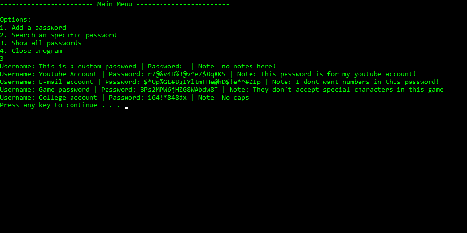

# Password Manager
This is a simple password manager made on C++, it has a random password generator with different settings and a password search function.

# Main Menu

The program has a main menu with 4 options, add a password, search an specific password, display all passwords, and close the program.

