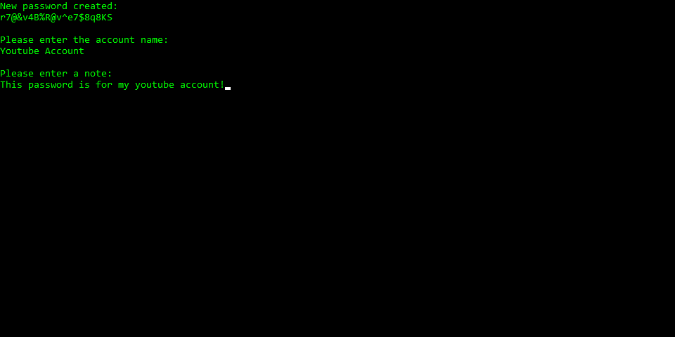

# Password Manager
This is a simple password manager made on C++, it has a random password generator with different settings and a password search function.

# Main Menu

The program has a main menu with 4 options, add a password, search an specific password, display all passwords, and close the program.

# Adding Passwords

The program allows for new passwords to be entered into the manager, it supports custom passwords and also allows the user to utilize a random password generator. The password generator allows for some settings such as password size and enabling special characters, caps, and numbers.

# Searching Passwords

From the main menu you can access two different functions to search for passwords, you can either display all the passwords you have stored or you can search a password by giving the program a keyword.
